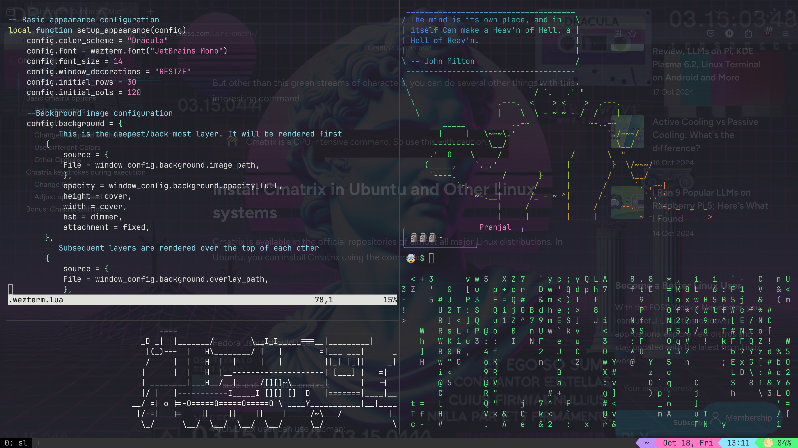
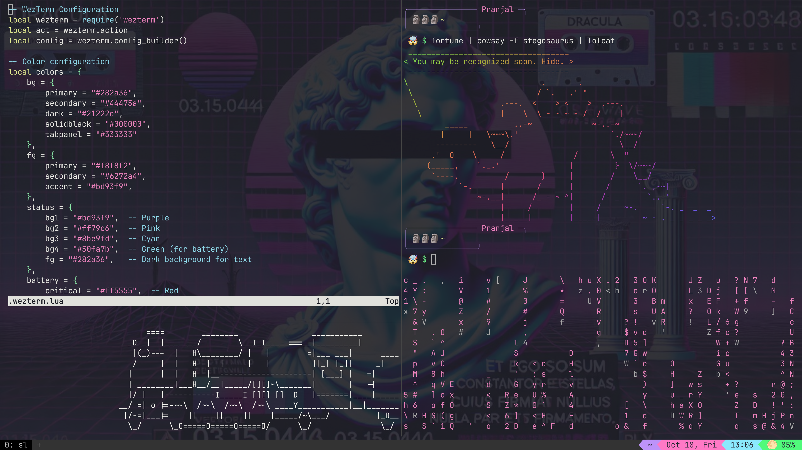
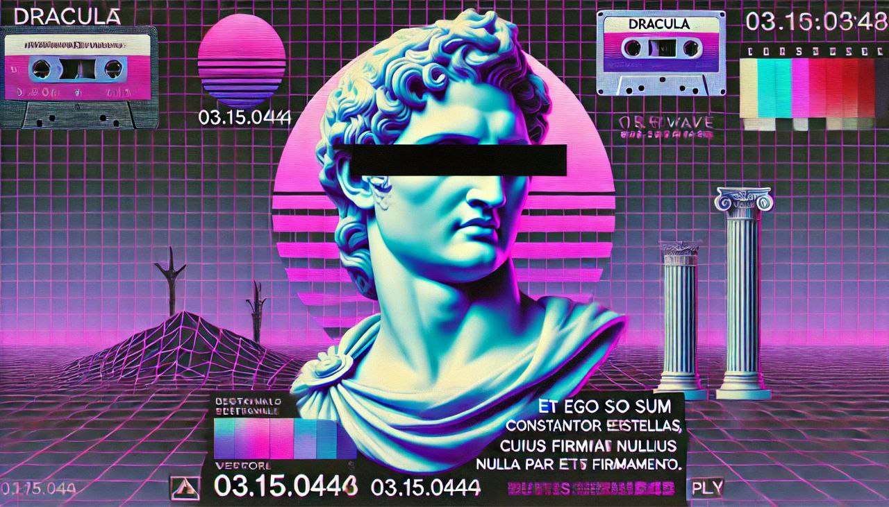

# My WezTerm Config

Hey! 👋

Here's my custom WezTerm config. I’ve set it up to be pretty neat with a mix of cool features like background images, battery status, tab navigation, and some fun color schemes. Feel free to use it, tweak it, or just check it out!

### Transparent Background Mode



### Opaque Background Mode



## What’s in This Config?

### Tabs and Panes

- Tabs are at the **bottom**.
- You can switch between tabs easily using **leader key** combos (I set it to `Alt + q`).
- Leader Key Wand `🪄`:
    - Whenever you press the leader key `(Alt + q)`, a little wand icon (`🪄✨`) will show up in the status bar to let you know you’re in leader mode. Why the wand? Because it causes all the magic to happen!!
- Split panes both **horizontally** and **vertically**, and even resize them with arrow keys (super handy if you multitask a lot).

### Key Bindings 🗝️

I've got a bunch of keybindings set up:
- **Tabs:**
  - New tab: `🪄✨` then `c`
  - Close tab: `🪄✨` then `x`
  - Move between tabs with `e` and `r`, with some magic (`🪄✨`) ofc!
  - Go to a particular tab with `🪄✨` + tab index
- **Panes:**
  - Split horizontally: `🪄✨` then `]`
  - Split vertically: `🪄✨` then `-`
  - Move between panes with `h`, `j`, `k`, `l`.
- **Resizing panes** with arrow keys (after hitting `🪄✨`).

### Background Images 🌄

Yep, I added custom background images. You can toggle between **transparent** and **opaque** backgrounds with `Alt + o`.  
- The primary background(Generated by ChatGPT...and that text's supposed to be a translation of Shakespeare into latin...terrible translation! Doesn't even make sense. Looks cool though!):



"But I am constant as the Northern Star, of whose true fixed and resting quality, there is no fellow in the firmament"

Maybe sth like:

"Sed ego sum tam constans quam stella septentrionalis, cuius nulla est par firmitati in firmamento"

- Overlay:


You can replace these with your own if you want. Just update the file paths in the config.

### Battery Status 🔋

If you're running on a laptop, it shows the battery percentage in the status bar with cute little icons:
- Full: `🌕`
- Charging: `⚡`
- Three Quarters = '🌖',
- Half = '🌗',
- Empty = '🌑',
- Low battery? You'll see a 🍕 icon (yeah, turns out there's no quarter of a moon).

### Fancy Status Bar

- It shows the current working directory (it shortens long paths so it fits nicely).
- Also has the date, time, and (if applicable) your battery status on the right side.
  
### Font and Appearance

- Using **JetBrains Mono** (a programmer's classic).
- Font size: 14px, enough to look crisp.
- Window has a little padding for aesthetics (and space for my tabs).


## How to Use It

1. **Clone** the repository to your local machine:
   ```bash
   git clone https://github.com/Nottletottle/wezterm-config.git
   ```

2. **Navigate** to the cloned directory:
   ```bash
   cd wezterm-config
   ```

3. You can either copy the files manually or **install GNU Stow** (you can do it your own way) and run the setup script to create symlinks for the WezTerm configuration and images:
   ```bash
   ./setup
   ```

4. **Install JetBrains Mono** (if you don't already have it) from [here](https://www.jetbrains.com/lp/mono/).

5. **Put your custom background images** in `~/exampleconfig/wezterm/images/` (or update the paths in the config if you want them somewhere else).

---

That’s pretty much it! 🎉  
Feel free to take it, change it, and make it your own!

---


